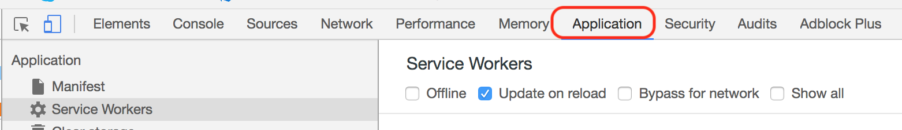
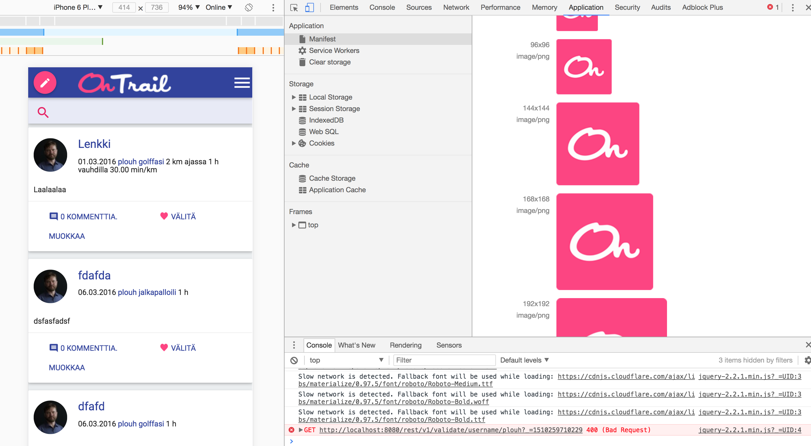
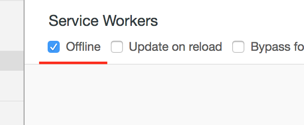
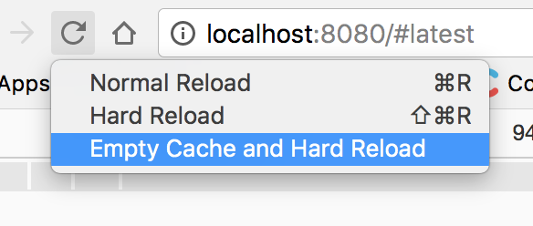

# Day 1

## Implement the idea (quick & dirty)

1. Code
2. ???
3. App is working, yes yes.

## Make it progressive web app

The goal of the first day is to make the web app base progressive and support offline mode.

## What being progressive web app means?

Within scope of day 1:

- You can install it as a "standalone" application on a mobile device or with a minimal browser chrome.
- Supports splash screen so the loading of the application is seamless
- Loads even when the device is offline (cache stylesheets, images, html and API calls)

Within scope of day 2:

- Possibility to synchronize data between client & server (offline edits)
- Push messages & "native" notifications
- etc...

## Hands-on!

Let's start to make our web app progressive.

### Install Lighthouse

Lighthouse is a wonderful Chrome browser-extension that generates audit reports of your site and gives you useful tips on how to fix the app.

- https://chrome.google.com/webstore/detail/lighthouse/blipmdconlkpinefehnmjammfjpmpbjk

Let's generate the report for http://beta.ontrail.net/

  

Not looking very good, even quite _legacyish_, would you say?

### We seem to lack at least web app manifest, so let's go ahead and add one.

  - https://developers.google.com/web/fundamentals/web-app-manifest/ and
  - https://developer.mozilla.org/en-US/docs/Web/Manifest

Here is what a sample [manifest.json](samples/manifest1.json) could look like.

Link it to the application with meta tag at the beginning of the page.

    <link rel="manifest" href="/manifest.json">

### Check with chrome dev tools application tab that all looks good

Chrome dev tools have "Application" -tab that you can use to check the PWA parts of your application

  

Open the manifest tab and go through the content

  

> Ups, bug with image size, lets fix that

  

Looking good, time to move on.

### Rerun Lighthouse to find out the next problem

  

Some more error and worse accessibility.  Results will vary depending on your computer load, so there is nothing to worry.  Rendering times may even get worse if there is extra penalty for hitting cache before network, but that should be fixed later.

Manifest error disappeared, so we can pick the next most important problem.

## Implement Service workers

First task ist to make application show something reasonable even when we are offline.

Let's use sample application from google codelabs for base as lighthouse instructed
  - https://codelabs.developers.google.com/codelabs/offline/#0

Add the code that loads service workers [to the very end of your index.html or other entry point](samples/init-service-workers.html)

Put browser to offline mode from developer tools

  

Let's try this with our own, Empty cache and Hard Reload (right click or two-finger -click the reload button)

  
  

Ok, so we at least are not getting the no network dialog, but it isn't really pretty though.

Let's add some stylesheets and scripts from our index.html to preload to our [sw.js](samples/sw.js)
- https://codelabs.developers.google.com/codelabs/offline/#6

Huh, no nothing??!?

Maybe we are missing something and merely caching urls is not enough? Let's add event listener to **fetch**-events and intercept the actual requests so something is actually put and fetched from cache.

- https://codelabs.developers.google.com/codelabs/offline/#7

So here is the [snippet](samples/fetch.js) to add to sw.js.  Reload and voilá, we are finally getting to somewhere.  Login is unfortunately non-possible while we are offline, so let's enable network and log in to the application to see what happens next.

Logged in, great, now turn the network back off again.

Darn, we are missing the actual content, since it comes not from a static resource but from via API call.

### _Pro tip; how to cache third party resources, when CORS headers are missing_

 https://filipbech.github.io/2017/02/service-worker-and-caching-from-other-origins

### Finally, cache the API responses

So we need to cache also api responses somwhow to make the app appear at least somewhat useful while offline.

Let's cache all rest api requests and then skip later those that should go to server always (login/logout and validations).  We need to ignore query parameters since it is used for cache busting in the existing web app and we definitely do not want to bust our newly created cache.

Here is the new [fetch](samples/fetch2.js)-interceptor that handles also API calls.

Let's try to navigate somewhere, like tags.

Great; the cache seems to work.  Now, how about another?

WTF? Still at the tags?  This is not the cache I am looking for.  Ach, it was the search query parameters that are still being ignored.

Ok, one more try, let's include query parameters in [supporting the search](samples/fetch3.js).

Now, let's do the search again.

Perfect!

## Reading: The offline cookbook for all kinds of recipes
- https://jakearchibald.com/2014/offline-cookbook/

# Day 2

## Notify when interesting stuff hapns

##  Sync with backend periodically to be sure we are up to date